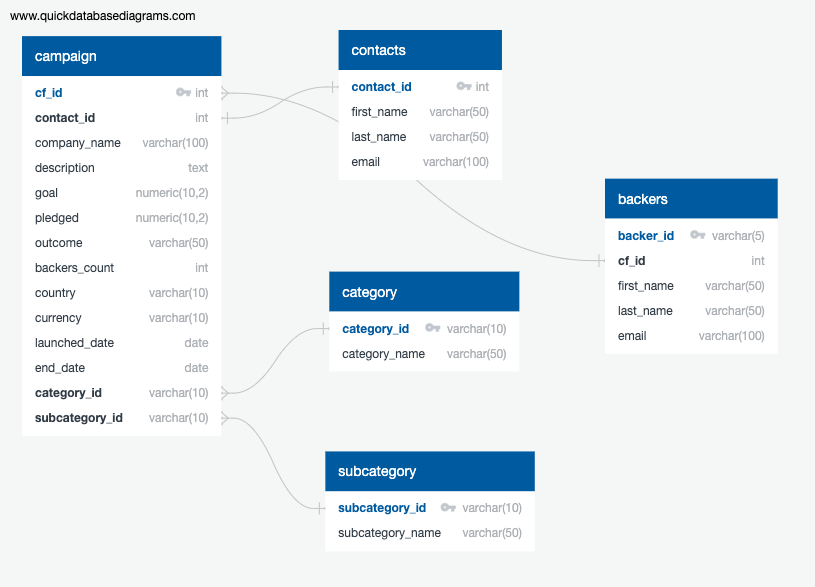

# Crowdfunding-ETL

## Overview 

***Background***
Independent Funding is a platform for crowdfunding independent projects or ventures. As a part of the analytics team, we are helpiing: Extracting and Transforming data into separate CSV files to upload to a PostgreSQL database. We will also be performing SQL queries to generate different reports from our large Excel file. 

***Purpose***
After going through the initial analysis, the company Independent Funding wants us to perform more analysis on a new dataset that contains information of the backers who pledged money for crowdfunding projects. From the new csv file, we are tasked to Extract - Transform - and Load (ETL) the new table into the database using Python, Pandas, Jupyter Notebook, and SQL series (PostgreSQL). 

Specifically, for this challenge we will create the following deliverables: 

* Deliverable 1: Extract Data
* Deliverable 2: Transform and Clean Data
* Deliverable 3: Create an ERD and Table Schema, and Load Data
* Deliverable 4: SQL Analysis

## Resources 
- Data Source: [backer_info.csv](https://github.com/meghanhkoon/Crowdfunding-ETL/blob/main/Resources/backer_info.csv). 
- Software: PostgreSQL 13.8, pgAdmin 13.8, Python, Pandas, and Jupyter Notebook 

## Results & Summary 

***Deliverable 1: Extract Data***

To extract the data from the original csv (backer_info.csv), we first had to read the csv file to a Pandas DataFrame. Then we iterated through the DataFrame and converted each row to a dictionary. See code below. 
```
# Iterate through the backers DataFrame and convert each row to a dictionary.
info_rows = []
for i, row in backers_info_df.iterrows():
    
    # Iterate through each dictionary (row) and get the values for each row using list comprehension.
    data = row['backer_info']
    converted_data = json.loads(data)
    
    row_values = [v for k, v in converted_data.items()]
    
    # Append the list of values for each row to a list.
    info_rows.append(row_values)

# Print out the list of values for each row.
print(info_rows)
```
Then we created a new DataFrame with our new rows and columns.


***Deliverable 2: Transform and Clean Data***

After Extracting the data, we then had to Transform and Clean the data using Pandas and Python in Jupyter Notebooks. We had to make sure that the cf_id column was an integer, split the name column into first_name and last_name columns, drop the name column, and reordered our final clean DataFrame. Lastly, we saved our final clean dataframe as a csv file ([backers.csv])(https://github.com/meghanhkoon/Crowdfunding-ETL/blob/main/CSV_Files/backers.csv).


***Deliverable 3: Create an ERD and Table Schema, and Load Data***

In our third step, we created an ERD and Table Schema using QuickDBD. Since we already had most of the tables, we had to just create a table for the backers dataset. Since the backer_id is unique to this dataset, it was the primary key. The cf_id column matched the cf_id column in the campaign table. Therefore, it is our foreign key. See our final ERD below. After we created a schema from our ERD, the new table was created and data was uploaded in our database. 



***Deliverable 4: SQL Analysis***

With all the data extracted, transformed, cleaned, and loaded to our database, we are finally able to do our SQL Analysis! From our [queries](https://github.com/meghanhkoon/Crowdfunding-ETL/blob/main/SQL/crowdfunding_SQL_Analysis.sql), we created two tables: 
1. [email_contacts_remaining_goal_amount.csv](https://github.com/meghanhkoon/Crowdfunding-ETL/blob/main/CSV_Files/email_contacts_remaining_goal_amount.csv) - To email each contact of every live campaign to inform them of how much of the goal remains. 
2. [email_backers_remaining_goal_amount.csv](https://github.com/meghanhkoon/Crowdfunding-ETL/blob/main/CSV_Files/email_backers_remaining_goal_amount.csv) - To send an email to each backer to let them know how much of the goal remains for each live campaign that they've pledged. 


